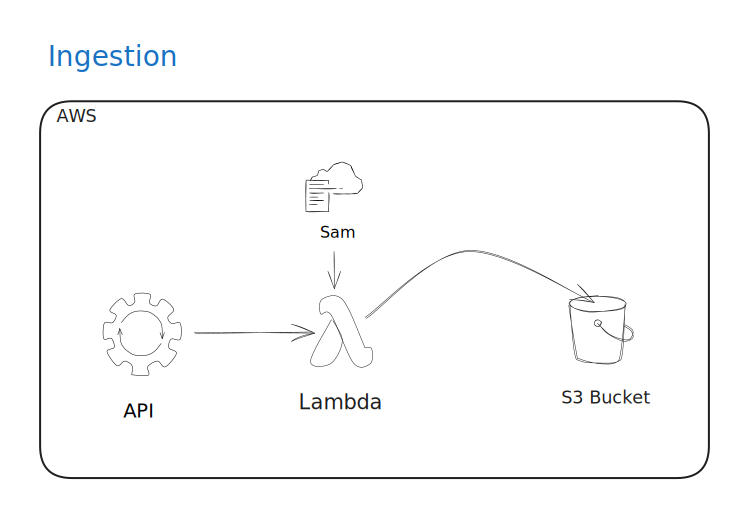

# ForecastFlow

## Architecting a Weather Forecasting ML Solution (AWS) 

This repository is dedicated to architecting a comprehensive end-to-end machine learning system for weather forecasting on AWS. This project emphasises the development and optimisation of four major pipelines crucial for a robust and efficient ML system: Ingestion Pipeline, Feature Pipeline, Train Pipeline, Serve Pipeline, and Continuous Training Pipeline.

## Overview

Machine learning systems demand a holistic approach that goes beyond model training. The aim of this project is to provide a modular and scalable solution, addressing each stage of the machine learning lifecycle.

### Pipelines

1. **Ingestion Pipeline:** The Ingestion Pipeline guarantees a smooth information flow by utilising an AWS Lambda function provisioned through AWS SAM. This function collects historical weather data from an API and dumps the acquired data into an S3 bucket, in batch mode.

    

2. **Feature Pipeline:** Transforms raw weather data into meaningful features that can be utilised by machine learning models. This pipeline focuses on data normalization, feature engineering and selection. The selected features are dumped in AWS Sagemaker Feature Store.

3. **Train Pipeline:** This pipeline incorporates model selection, hyperparameter tuning, and evaluation strategies to ensure optimal forecasting performance.

4. **Serve Pipeline:** Deploys trained models to staging and production environments. The Serve Pipeline is designed to handle model deployment, monitoring, and scaling to meet the demands of operational forecasting.

5. **Continuous Training Pipeline:** This pipeline automates the retraining process, adapting models to evolving weather patterns and improving forecasting precision over time.

## Getting Started

Explore the respective directories for each pipeline. 

**Note: This project is ongoing